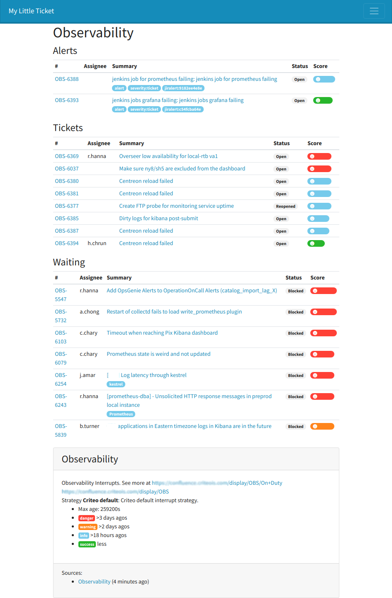

# My Little Ticket :ticket: 

[](https://travis-ci.org/iksaif/my-little-ticket)
[](https://coveralls.io/github/iksaif/my-little-ticket?branch=master)

UI and API to show an aggregate status of your services.

[](doc/my-little-ticket.png)

*This is currently under active development and not ready for production.*


## Quickstart

```bash
virtualenv venv -p python3
source venv/bin/activate
cp examples/local_settings.py defcon/
pip install -e .
pip install -r requirements.txt
./manage.py migrate
./manage.py migrate --run-syncdb
./manage.py createsuperuser
./manage.py runserver
```

## Configuration

See [local_settings](examples/local_settings.py).


## Authentication

This project is using [django-allauth](https://django-allauth.readthedocs.io/en/latest/).

## API

Simply go to `/swagger/` or `/api/` to see what can be done.

## Plugins

### Strategies

A strategy is a way to score and organize tickets on a board. Check
[base.py](my_little_ticket/plugins/base.py) and [default.py](my_little_ticket/plugins/default.py) for an example.
You'll need to implement only a few functions.

And add it to your settings.py:

```python
MLT_STRATEGIES = [
   ...
    'my_module.MyStrategy',
]
```
### Plugins

A plugin is a way to fetch ticket from a source. Currently this project
can only fetch tickets from JIRA, but you can easilly create your own plugin,
take a look at [base.py](my_little_ticket/plugins/base.py) and
[jira](my_little_ticket/plugins/jira.py) to know more.

```python
MLT_PLUGINS = [
    ...
    'my_module.MyPlugin'
]
```
